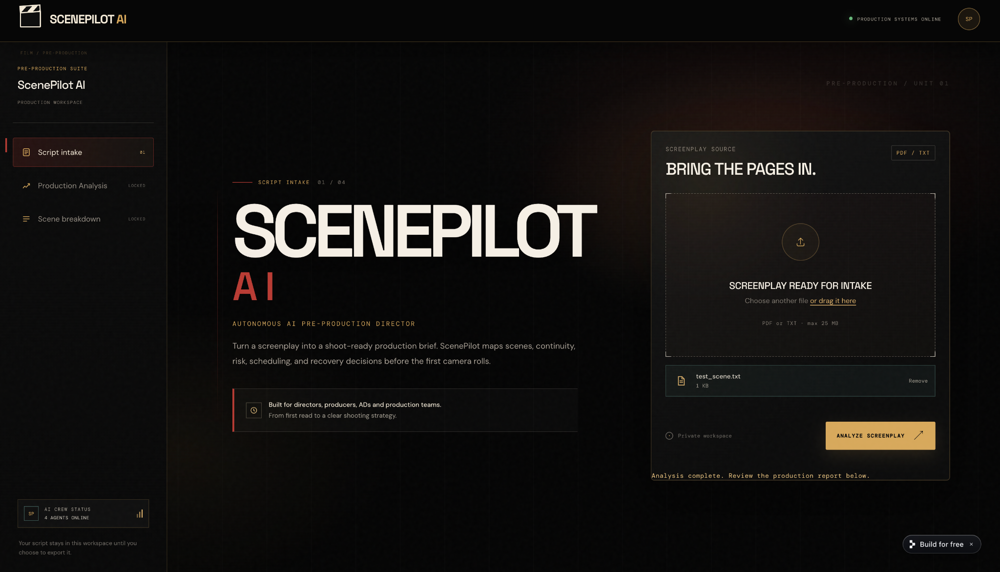
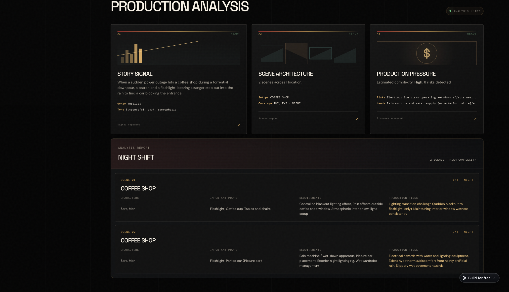
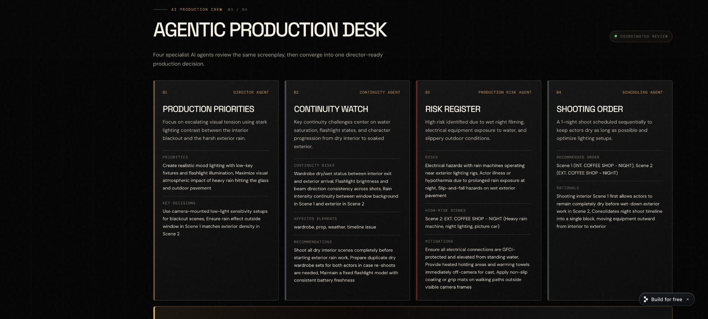
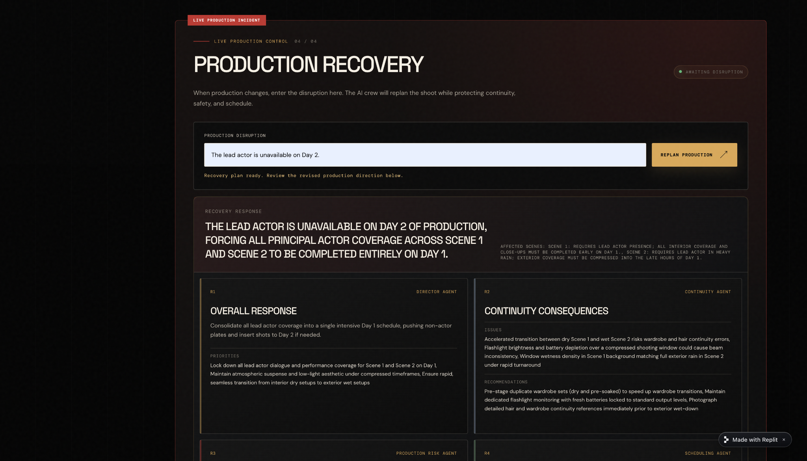
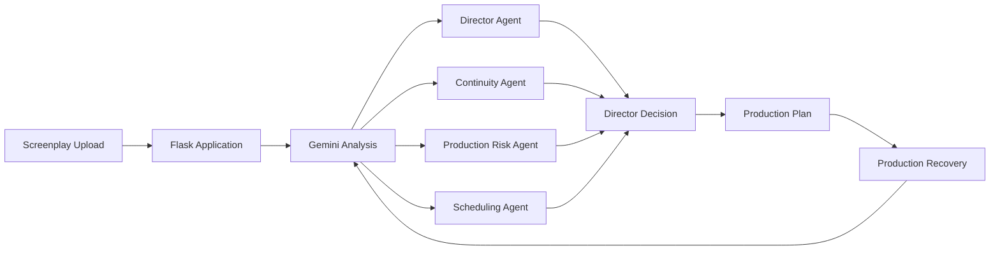

# 🎬 ScenePilot AI

### Autonomous AI Pre-Production Director

**ScenePilot AI turns a screenplay into a production-ready plan using coordinated AI agents for story analysis, continuity, production risk, scheduling, and real-time disruption recovery.**

🌐 **Live application:** https://scene-pilot-ai--eemanefatimaawa.replit.app

🏆 Built for **Agentic Cinema: The Blockbuster Hackathon**  
🤝 Partner track: **Replit**

---

## Product Preview

### Script Intake


### Production Analysis


### Agentic Production Desk


### Production Recovery


---

## The Problem

Film and television pre-production requires directors and production teams to manually turn scripts into scene breakdowns, continuity notes, risk assessments, and shooting schedules. These decisions are interconnected, and a last-minute disruption can force several departments to re-plan at once.

ScenePilot AI brings those tasks into one AI-assisted production workspace.

## The Solution

Upload a screenplay and ScenePilot creates a structured production brief. Four specialist AI perspectives examine the same screenplay, and their recommendations are combined into a director-ready decision.

The system also includes **Production Recovery**: when something changes during production — for example, an actor becomes unavailable — ScenePilot evaluates the disruption and generates a revised production strategy.

## AI Production Crew

| Agent | Responsibility |
| --- | --- |
| 🎥 **Director Agent** | Identifies creative and production priorities and turns the script into an actionable directing strategy. |
| 🔗 **Continuity Agent** | Tracks characters, props, wardrobe, locations, weather, and timeline continuity. |
| ⚠️ **Production Risk Agent** | Identifies difficult, expensive, dangerous, or logistically complex production elements and proposes mitigations. |
| 📅 **Scheduling Agent** | Recommends an efficient shooting order based on locations, setups, continuity, and production constraints. |
| 🎬 **Director Decision** | Synthesizes the specialist recommendations into one production-ready decision. |

## How It Works



### 1. Script Intake
The user uploads a screenplay through the cinematic production workspace.

### 2. Production Analysis
ScenePilot extracts the story signal, scene architecture, characters, props, production requirements, complexity, and production risks.

### 3. Agentic Production Desk
Four specialist AI perspectives review the screenplay from different production responsibilities before their recommendations converge into a final director decision.

### 4. Production Recovery
A production team can enter a real-world disruption. ScenePilot identifies affected scenes, re-evaluates production constraints, and produces a recovery plan rather than requiring the team to rebuild the schedule manually.

## Example: *Night Shift*

The included demonstration screenplay contains an interior and exterior coffee-shop sequence during heavy rain and a power outage. ScenePilot identifies the screenplay's thriller tone, maps its scenes and production requirements, flags risks such as wet-weather electrical equipment and continuity challenges, and recommends a shooting strategy across the specialist agents.

## Technology

- **Gemini** — screenplay reasoning, structured production analysis, agent perspectives, and recovery planning
- **Flask / Python** — application backend and AI orchestration endpoints
- **JavaScript** — interactive screenplay upload, analysis, and recovery workflow
- **HTML + CSS** — cinematic production interface
- **Replit** — development workflow and public deployment for the Replit partner track

## Repository Structure

The working ScenePilot Flask application is located at:

```text
artifacts/scene-pilot-ai/
├── app.py
├── requirements.txt
├── templates/
│   └── index.html
├── static/
│   ├── app.js
│   ├── styles.css
│   └── favicon.svg
└── .replit-artifact/
    └── artifact.toml
```

The repository also contains Replit-generated workspace/scaffold files used during development. The directory above contains the core hackathon application.

## Run Locally

### 1. Clone the repository

```bash
git clone https://github.com/eemanefatimaawan567-glitch/ScenePilot-AI.git
cd ScenePilot-AI/artifacts/scene-pilot-ai
```

### 2. Create a virtual environment

```bash
python3 -m venv .venv
source .venv/bin/activate
```

### 3. Install dependencies

```bash
pip install -r requirements.txt
```

### 4. Configure Gemini

Set your own Gemini API key as an environment variable. **Never commit API keys to GitHub.**

```bash
export GEMINI_API_KEY="YOUR_API_KEY"
```

### 5. Start ScenePilot

```bash
python app.py
```

Open the local URL displayed by Flask in your browser.

## API Routes

- `GET /` — ScenePilot production workspace
- `POST /analyze` — analyzes the uploaded screenplay and generates the production plan
- `POST /replan` — evaluates a production disruption and generates a recovery strategy

## Security

ScenePilot reads `GEMINI_API_KEY` from an environment variable. Credentials are not intentionally stored in frontend code or committed to this repository. The deployed application uses Replit Secrets for environment configuration.

## Current Prototype Scope

The hackathon prototype is optimized for **TXT screenplay analysis**. The interface may display additional screenplay file types, but TXT is the tested analysis workflow used for the demonstration.

## Why ScenePilot

ScenePilot is designed around a simple idea: an AI filmmaking tool should not only summarize a screenplay — it should help a production team **make decisions**.

By combining screenplay understanding, specialist production perspectives, and disruption recovery in one workflow, ScenePilot demonstrates how agentic AI can act as a practical pre-production coordination layer for filmmakers.

---

## License

This project is released under the **MIT License**. See [`LICENSE`](LICENSE) for details.

---

**ScenePilot AI — From screenplay to shoot-ready strategy.**
